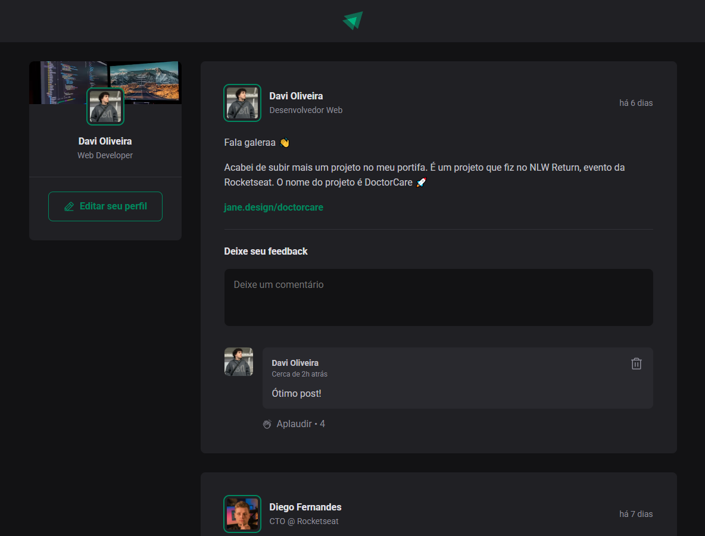
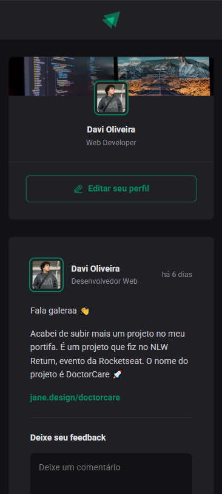

# Ignite Feed

This was the project developed in level 01 of Rocketseat's React course.

## Table of contents

- [Overview](#overview)
  - [Screenshots](#screenshots)
- [How to Run the Project](#how-to-run-the-project)
- [My process](#my-process)
  - [Developed with](#developed-with)
- [Author](#author)

## Overview

This project simulates a social media feed, allowing users to comment, like, and delete comments. Additionally, it features a date system that shows how long ago the post was published.

### Screenshots

#### Desktop design


#### Desktop mobile design


## How to Run the Project

To run the project locally, follow these steps:

1. Clone the repository:
   ```bash
   git clone "https://github.com/itsdavss/ignite-feed"

2. Navigate to the project folder:
   ```bash
   cd ignite-feed

3. Install the dependencies:
   ```bash
   npm install

4. Start the development server:
   ```bash
   npm run dev

## My process

During the development of this project alongside the professor, several important React concepts were taught, such as componentization, props, state, immutability, and hooks. Additionally, TypeScript was applied to the application to add static typing.

### Developed with

- Typescript 
- React

## Author

- GitHub - [itsdavss](https://github.com/itsdavss)
- My portfolio - [Davi Oliveira](https://itsdavss.github.io/portfolio-davi/)